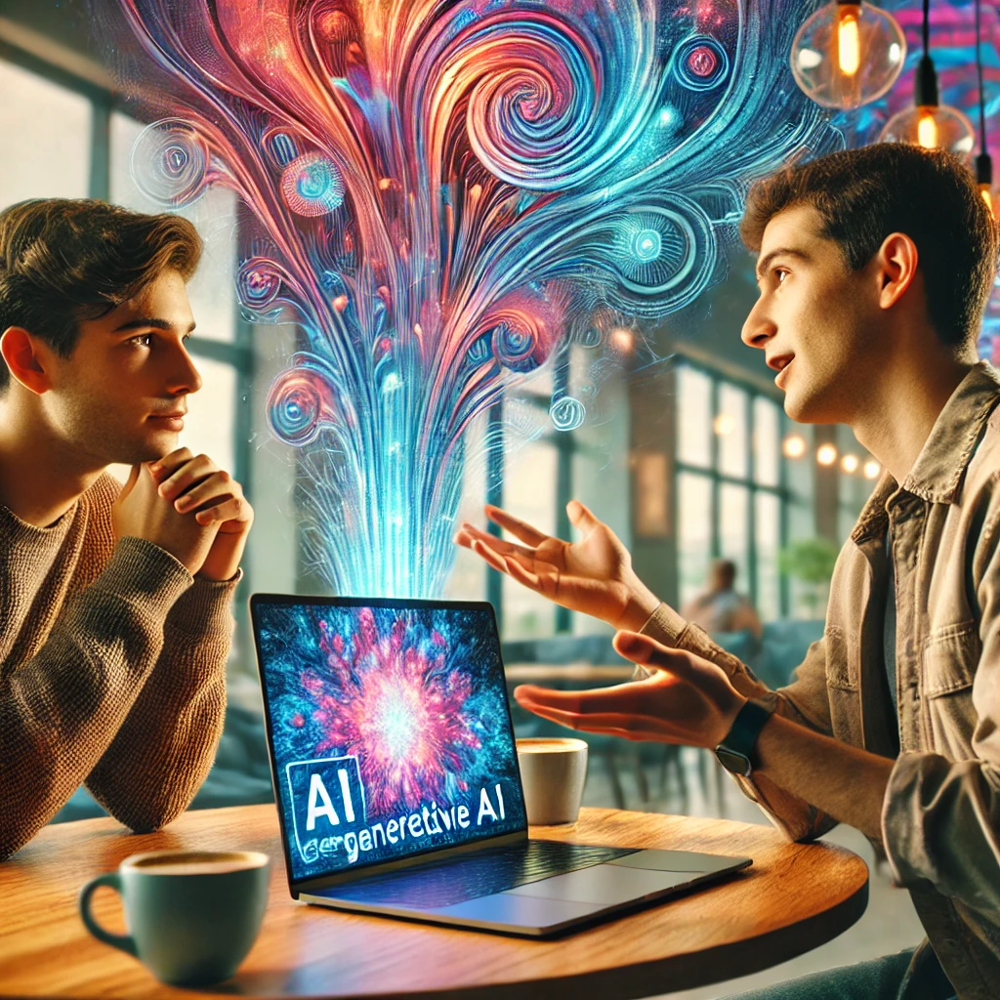

# A Jornada da IA: Um Passeio pelo Futuro 🌌

## 📒 Descrição
Durante minha participação no Bootcamp Nexa - Fundamentos de IA Generativa e Claude 3, fui desafiado a explorar o fascinante universo das IAs Generativas. 

## 🤖 Tecnologias Utilizadas
- IA Generativa **[ChatGPT](https://chat.openai.com)** para roteirização e arte visual;

## 🧐 Processo de Criação
Utilizei o "ChatGPT" para revisar minha pesquisa sobre IAs Generativas, estruturar o conteúdo e refinar minhas ideias. Por outro lado, o "Leonardo AI" foi usado para gerar imagens exclusivas para o nosso e-book. Para concluir, a montagem final foi feita no Libre Office, por ser uma ferramenta open-source para edição de texto.

## 🚀 Resultados
**Título: Descobrindo as IAs Generativas**  

**Personagem 1**: (Curioso)  
Cara, eu ouvi falar muito sobre IA generativa ultimamente, mas ainda não entendi direito o que é. Você pode me explicar?  

**Personagem 2**: (Entusiasmado)  
Claro! É basicamente uma tecnologia que consegue criar coisas novas, como textos, imagens, músicas e até vídeos. Ela usa algoritmos avançados para aprender com dados existentes e gerar conteúdo original.  

**Personagem 1**: (Impressionado)  
Sério? Então, tipo, ela pode criar uma música do zero ou desenhar uma imagem?  

**Personagem 2**:  
Exatamente! Por exemplo, sabe aquelas imagens hiper-realistas ou surreais que parecem saídas de um sonho? Muitas delas são criadas por IAs generativas, como o DALL·E.  

**Personagem 1**:  
Ah, e aquele lance de criar texto, tipo você aqui me explicando. É o mesmo princípio?  

**Personagem 2**:  
Isso mesmo! Modelos como o ChatGPT conseguem gerar respostas, histórias ou até roteiros inteiros com base no que você pede. É como ter um assistente criativo à disposição.  

**Personagem 1**: (Animado)  
Que incrível! Dá pra usar isso pra criar jogos, escrever livros ou até compor trilhas sonoras.  

**Personagem 2**:  
Exato! As possibilidades são praticamente infinitas. A IA não substitui a criatividade humana, mas amplifica nossas ideias e agiliza o processo de criação.  

**Personagem 1**: (Refletindo)  
Uau, isso vai mudar tudo. Acho que vou começar a estudar mais sobre IA generativa.  

**Personagem 2**: (Sorrindo)  
Boa ideia! É o futuro da tecnologia e da criatividade. Bem-vindo ao mundo das possibilidades infinitas!  

## 💭 Reflexão (GPT)
**Reflexão sobre o Uso das IAs Generativas**  

O avanço das IAs generativas representa um marco significativo na interseção entre tecnologia e criatividade. Essas ferramentas não apenas nos desafiam a repensar como criamos, mas também como interpretamos o que é "original". Ao permitir que máquinas gerem textos, imagens, músicas e até vídeos, abrimos portas para possibilidades que antes pareciam restritas à imaginação humana.  

Por outro lado, o uso dessa tecnologia nos força a refletir sobre questões éticas. Como distinguir o que é autêntico do que é artificial? Como garantir que essas ferramentas não sejam usadas de forma prejudicial, como na criação de desinformação ou no plágio de trabalhos artísticos?  

Além disso, há um impacto direto no mercado de trabalho e no papel dos criadores. A IA pode ser vista como uma aliada, agilizando processos e ampliando ideias, ou como uma concorrente, dependendo de como for implementada. Porém, é importante lembrar que, embora as IAs possam gerar conteúdo impressionante, elas ainda dependem das intenções humanas e de dados previamente fornecidos.  

No fundo, o maior poder das IAs generativas está na capacidade de nos inspirar e ampliar nossos horizontes criativos. Não se trata de substituir a criatividade humana, mas de potencializá-la. Assim, o verdadeiro desafio é equilibrar inovação e responsabilidade, explorando o potencial das IAs enquanto mantemos a ética e a humanidade no centro de tudo.
